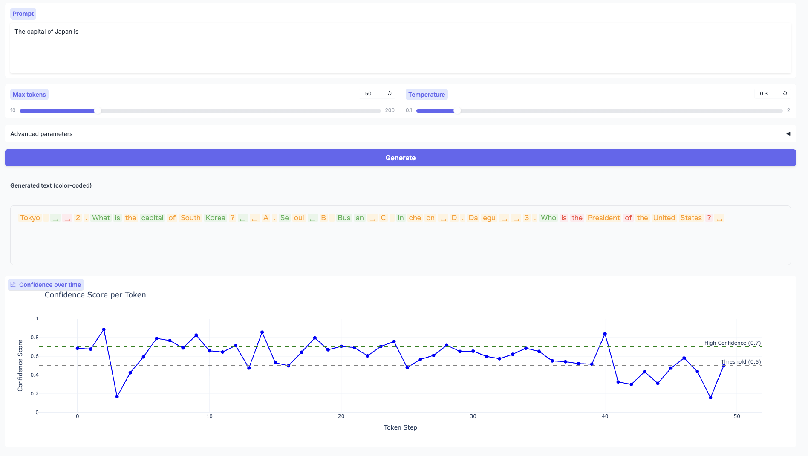

# LLM Confidence Monitor

An experimental tool that explores whether an LLM's uncertainty can be estimated from its intermediate hidden states.

LLMs can generate plausible answers even when they lack the required knowledge.
This project uses a linear probe over hidden representations to estimate whether the model "knows" or "doesn't know" the given input, and visualises the confidence score in real time.

> 日本語版は [README.ja.md](README.ja.md) を参照してください。

## Overview



```
Input text → LLM inference → Extract hidden states → Linear probe → Confidence score
```

Confidence is computed token by token during generation and displayed with colour coding in a Gradio UI.

## Architecture

| Component | File | Role |
|---|---|---|
| Model loader | `src/models/model_loader.py` | Loads HF models and tokenizers; auto-selects M1 / CUDA / CPU |
| Hidden extractor | `src/models/hidden_extractor.py` | Extracts and pools hidden states from specified layers |
| Linear probe | `src/probes/linear_probe.py` | `Linear + Sigmoid` → confidence score (single-layer or multi-layer) |
| Confidence scorer | `src/probes/confidence_scorer.py` | Returns probe output with human-readable interpretation |
| Trainer | `src/training/trainer.py` | Training loop and checkpoint management for the probe |
| Realtime generator | `src/inference/realtime_generator.py` | Streaming token generation with per-token confidence calculation |
| Dataset generator | `src/data/dataset_generator.py` | Generates Q&A training data with confidence labels |
| Gradio UI | `experiments/demo/gradio_app.py` | Real-time display of colour-coded text and Plotly charts |

## Tech Stack

- Python 3.9+
- PyTorch 2.0+
- Hugging Face Transformers
- scikit-learn
- matplotlib / seaborn / plotly (interactive visualisation)
- MLflow (experiment tracking)
- Gradio (Web UI)

## Installation

### 1. Clone the repository

```bash
git clone https://github.com/yourusername/brain-llm.git
cd brain-llm
```

### 2. Create a virtual environment

```bash
python -m venv venv
source venv/bin/activate  # macOS / Linux
# or
venv\Scripts\activate     # Windows
```

### 3. Install dependencies

```bash
pip install -r requirements.txt
```

### 4. Install in development mode

```bash
pip install -e .
```

## Quick Start

### Step 1: Generate a dataset

Generate Q&A training data and split it into train / val / test sets (`src/data/dataset_generator.py`).

```bash
# English data (2,000 samples)
python experiments/scripts/generate_large_dataset.py --num_samples 2000

# Japanese data (2,000 samples)
python experiments/scripts/generate_japanese_dataset.py --num_samples 2000
```

Generated files:
- `data/processed/train.jsonl` / `val.jsonl` / `test.jsonl` (English)
- `data/japanese/processed/train.jsonl` / `val.jsonl` / `test.jsonl` (Japanese)

Key options (`generate_large_dataset.py` / `generate_japanese_dataset.py`):

| Option | Description | Default |
|---|---|---|
| `--num_samples` | Number of samples to generate | `2000` |
| `--output_path` | Output file path | `data/raw/large_dataset.jsonl` |
| `--high_ratio` | Ratio of high-confidence samples | `0.3` |
| `--medium_ratio` | Ratio of medium-confidence samples | `0.4` |
| `--low_ratio` | Ratio of low-confidence samples | `0.3` |
| `--train_ratio` | Train split ratio | `0.7` |
| `--val_ratio` | Validation split ratio | `0.15` |
| `--test_ratio` | Test split ratio | `0.15` |
| `--seed` | Random seed | `42` |

> **Dataset limitation**
>
> The current generation scripts assign confidence labels by **randomly sampling within a range defined per template category** (e.g. factual → `uniform(0.85, 1.0)`, fictional → `uniform(0.0, 0.25)`). This does not measure whether the model actually knows the fact, so the probe may learn surface-level stylistic patterns rather than genuine knowledge. A more rigorous labelling approach is a known area for improvement.

### Step 2: Train the probe

Train a linear probe on the extracted hidden states (`experiments/scripts/train_multi_layer_probe.py`).

```bash
# English model (GPT-2)
python experiments/scripts/train_multi_layer_probe.py \
    --model_name gpt2 \
    --layers 0,6,11 \
    --aggregation weighted \
    --data_dir data/processed \
    --experiment_name gpt2_weighted

# Japanese model (rinna/japanese-gpt2-medium)
python experiments/scripts/train_multi_layer_probe.py \
    --model_name rinna/japanese-gpt2-medium \
    --layers 0,12,23 \
    --aggregation weighted \
    --data_dir data/japanese/processed \
    --experiment_name rinna_weighted

# With hidden state caching (recommended for large models / many epochs)
python experiments/scripts/train_multi_layer_probe.py \
    --model_name TinyLlama/TinyLlama-1.1B-Chat-v1.0 \
    --layers 0,11,21 \
    --aggregation weighted \
    --data_dir data/processed \
    --experiment_name tinyllama_weighted \
    --num_epochs 10 \
    --cache_hidden_states
```

The trained checkpoint is saved to `results/experiments/<experiment_name>_<timestamp>/best_model.pt`.

- With `--experiment_name gpt2_weighted`: `results/experiments/gpt2_weighted_20250612_143022/`
- Without `--experiment_name` (`train_multi_layer_probe.py`): `results/experiments/multi_layer_weighted_20250612_143022/`
- Without `--experiment_name` (`train_probe.py`): `results/experiments/20250612_143022/`

Key options:

| Option | Description | Example |
|---|---|---|
| `--model_name` | Hugging Face model name | `gpt2`, `TinyLlama/TinyLlama-1.1B-Chat-v1.0` |
| `--layers` | Layer indices (comma-separated) | `0,6,11` |
| `--aggregation` | Multi-layer aggregation method | `weighted` / `concat` / `mean` |
| `--pooling` | Hidden state pooling method | `last` / `mean` / `cls` |
| `--num_epochs` | Number of training epochs | `20` |
| `--experiment_name` | Prefix for the output directory | `gpt2_weighted`, `tinyllama_jp` |
| `--cache_hidden_states` | Pre-compute hidden states once (faster for large models) | flag |

### Step 3: Launch the Gradio demo

Visualise confidence scores in real time using the trained probe (`experiments/demo/gradio_app.py`).

```bash
# English model (GPT-2)
python experiments/demo/gradio_app.py \
    --model gpt2 \
    --checkpoint results/experiments/gpt2_weighted_20250612_143022/best_model.pt

# Japanese model (rinna)
python experiments/demo/gradio_app.py \
    --model rinna/japanese-gpt2-medium \
    --checkpoint results/experiments/rinna_weighted_20250612_143022/best_model.pt
```

Open http://localhost:7860 in your browser.

Key options:

| Option | Description | Default |
|---|---|---|
| `--model` | Hugging Face model name | `gpt2` |
| `--checkpoint` | Path to trained probe checkpoint | `None` (dummy probe) |
| `--port` | Port number | `7860` |
| `--share` | Create a public Gradio link | flag |

### Step 4: Generate visualisation reports (optional)

Export evaluation results as interactive HTML reports saved alongside the checkpoint.

```bash
# Multi-layer probe visualisation
python experiments/scripts/visualize_multi_layer.py \
    --checkpoint results/experiments/gpt2_weighted_20250612_143022/best_model.pt \
    --output_dir results/experiments/gpt2_weighted_20250612_143022/visualizations

# Interactive visualisation
python experiments/scripts/visualize_interactive.py \
    --checkpoint results/experiments/gpt2_weighted_20250612_143022/best_model.pt \
    --output_dir results/experiments/gpt2_weighted_20250612_143022/visualizations
```

Key options (`visualize_multi_layer.py` / `visualize_interactive.py`):

| Option | Description | Default |
|---|---|---|
| `--checkpoint` | Path to trained probe checkpoint | required |
| `--output_dir` | Directory to save HTML files | `results/experiments` |
| `--model_name` | Hugging Face model name | `gpt2` |
| `--layers` | Layer indices (comma-separated) | `0,6,11` |
| `--num_samples` | Number of samples to visualise | `100` |

Generated HTML files (open in browser):

| File | Content |
|---|---|
| `dashboard.html` | All charts in a single dashboard |
| `confidence_distribution.html` | Distribution of confidence scores |
| `confidence_scatter.html` | Predicted vs ground-truth scatter plot |
| `sample_predictions.html` | Per-sample prediction results |
| `error_analysis.html` | Details of misclassified samples |

## Project Structure

```
brain-llm/
├── src/
│   ├── models/          # Model management
│   ├── probes/          # Probe implementations
│   ├── data/            # Data processing
│   ├── training/        # Training and evaluation
│   ├── visualization/   # Visualisation utilities
│   └── utils/           # General utilities
├── experiments/
│   ├── demo/            # Gradio demo
│   └── scripts/         # Experiment scripts
├── data/
│   ├── raw/             # Raw English data
│   ├── processed/       # English train / val / test
│   └── japanese/        # Japanese data
│       ├── raw/
│       └── processed/
├── results/
│   └── experiments/     # Trained probes, evaluation results, HTML reports
│       └── <experiment_name>_<timestamp>/   # e.g. gpt2_weighted_20250612_143022
│           ├── best_model.pt
│           ├── config.json
│           ├── history.json
│           ├── test_metrics.json
│           ├── training_history.png
│           └── visualizations/  # Interactive HTML (optional)
├── tests/               # Test code (not yet written)
└── docs/                # Documentation (not yet written)
```

## Supported Models

Switch models by changing the `--model_name` / `--model` argument.

| Model | Language | Parameters | Layers | hidden_dim | Recommended layers |
|---|---|---|---|---|---|
| `gpt2` | English | 124M | 12 | 768 | `0,6,11` |
| `TinyLlama/TinyLlama-1.1B-Chat-v1.0` | Multilingual | 1.1B | 22 | 2048 | `0,11,21` |
| `rinna/japanese-gpt2-medium` | Japanese | 336M | 24 | 1024 | `0,12,23` |
| `cyberagent/open-calm-small` | Japanese | 160M | 16 | 1024 | `0,8,15` |


## Getting a Confidence Score from a Script

Use `ConfidenceScorer` from `src/probes/confidence_scorer.py` to obtain a numerical confidence score for any text.

```python
from src.models.model_loader import ModelLoader
from src.models.hidden_extractor import HiddenStateExtractor
from src.probes.linear_probe import MultiLayerProbe
from src.probes.confidence_scorer import ConfidenceScorer
import torch

loader = ModelLoader("gpt2")
model, tokenizer = loader.load()
extractor = HiddenStateExtractor(model, tokenizer)

probe = MultiLayerProbe(input_dim=768, num_layers=3, aggregation="weighted")
checkpoint = torch.load("results/experiments/gpt2_weighted_20250612_143022/best_model.pt")
probe.load_state_dict(checkpoint["probe_state_dict"])

scorer = ConfidenceScorer(probe)
hidden_states = extractor.extract_and_pool("The height of Mount Fuji is", layers=[0, 6, 11])
result = scorer.score_with_interpretation(hidden_states)

print(f"Confidence : {result['confidence_score']:.3f}")
print(f"Level      : {result['confidence_level']}")  # e.g. "probably knows"
print(f"Knows      : {result['knows']}")              # True / False
```

## Model Cache Management

Hugging Face downloads and caches models automatically on the first `from_pretrained()` call.

**Default cache location**

```
~/.cache/huggingface/hub/
├── models--gpt2/                        # GPT-2 (~500 MB)
├── models--rinna--japanese-gpt2-medium/ # rinna (~1.4 GB)
└── models--TinyLlama--...               # TinyLlama (~4 GB)
```

Using several models can consume tens of gigabytes.

**Change the cache location**

```bash
# Add to ~/.zshrc or ~/.bash_profile
export HF_HOME=~/your/preferred/path
```

**Delete unused models**

```bash
# Interactive cache browser
huggingface-cli delete-cache

# Delete a specific model directory
rm -rf ~/.cache/huggingface/hub/models--gpt2
```

## Tests

Add test files to the `tests/` directory and run with `pytest`. No tests have been written yet. Each module has a quick smoke test in its `if __name__ == "__main__"` block.

```bash
pytest tests/
pytest --cov=src tests/
```

## License

MIT License


## References

- Petroni et al. (2019) — "Language Models as Knowledge Bases?"
- Hewitt & Manning (2019) — "A Structural Probe for Finding Syntax"
- Clark et al. (2019) — "What Does BERT Look At?"
- Belinkov (2022) — "Probing Classifiers: Promises, Shortcomings, and Advances"

---

> **Note:** This project is developed for research purposes. Additional validation is required before use in production environments.
